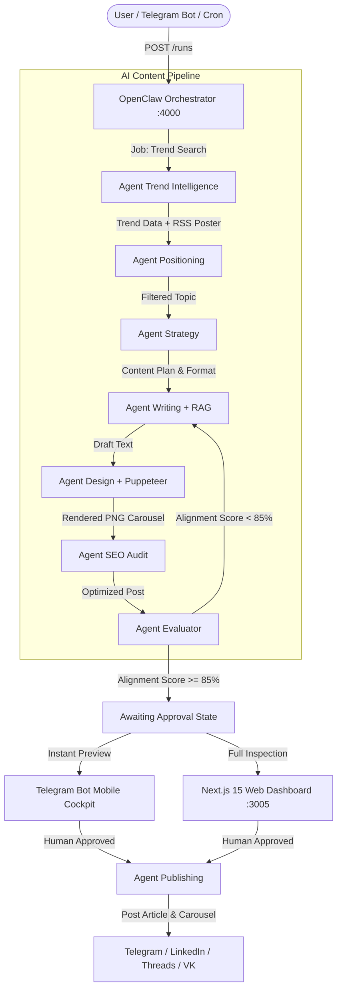

# 🤖 LinkedIn & Multi-Platform AI Content Pipeline

> **An autonomous, multi-tenant B2B & Media content generation, design & publishing platform powered by microservice AI agents, RAG fact-grounding, Puppeteer carousel rendering, and Telegram Human-in-the-Loop moderation.**


[](https://nodejs.org/)
[](https://www.typescriptlang.org/)
[](https://nextjs.org/)
[](https://bullmq.io/)
[](https://www.docker.com/)
[](https://core.telegram.org/bots)

---

## 📋 Table of Contents

1. [🌟 Business Value & Core Capabilities](#-business-value--core-capabilities)
   - [The Problem We Solve](#the-problem-we-solve)
   - [Key Capabilities](#key-capabilities)
   - [Multi-Tenant Portals](#multi-tenant-portals)
2. [🏗 System Architecture & Tech Stack](#-system-architecture--tech-stack)
   - [Agent Interaction Flowchart](#agent-interaction-flowchart)
   - [Microservices Breakdown](#microservices-breakdown)
   - [Reliability & Brand Safety Mechanisms](#reliability--brand-safety-mechanisms)
3. [📱 Telegram Bot: Mobile Human-in-the-Loop](#-telegram-bot-mobile-human-in-the-loop)
4. [🚀 Quickstart & Setup Guide](#-quickstart--setup-guide)
   - [Prerequisites](#prerequisites)
   - [Environment Setup (.env)](#environment-setup-env)
   - [Docker Compose Deployment](#docker-compose-deployment)
   - [Database Seeding](#database-seeding)
5. [🧪 Testing & API Reference](#-testing--api-reference)
6. [📚 Documentation Index](#-documentation-index)

---

## 🌟 Business Value & Core Capabilities

### The Problem We Solve

Creating high-performing B2B and media content (**LinkedIn, Telegram, Threads, VK, Instagram**) traditionally requires a large agency: *a copywriter, a domain engineer (GxP / system architecture / cinema lore), a graphic designer, an editor, and an SMM manager*. Running such a team costs **$3,000 to $10,000+ per month**, and publishing a single verified post with custom graphics takes 2–3 days.

This platform automates the end-to-end content engineering pipeline:
- **Reduces content marketing costs by up to 90%**.
- **Generates publish-ready posts with styled carousels in 20 seconds**.
- **Guarantees 100% Brand Safety & Regulatory Compliance** — zero numeric hallucinations, strict adherence to FDA/EMA standards (21 CFR Part 11, GxP), zero forbidden terms, and zero cross-brand hashtag leakage.
- **Human-in-the-Loop (HITL) via Telegram:** Approve, edit copy, or trigger re-generation in 1 tap directly from your phone.

---

### Key Capabilities

- 🏢 **Multi-Tenancy Architecture (`tenantId`):** Manage dozens of independent brands and media channels on a single infrastructure with isolated style guides, color palettes, and factual knowledge bases.
- 🎨 **Automated Puppeteer Carousel Engine:** Dynamically renders high-resolution (1080x1350 PNG) branded carousels tailored to post topics with SVG/PNG illustrations and dynamic article cover extraction.
- 📱 **Telegram Bot Workflow:** Full mobile moderation cockpit — album previews, inline editing, live container logs viewing, and interactive `/daily_cinema` RSS feed curator.
- 📚 **RAG Fact Grounding:** Automatic verification of technical specs and regulatory numbers against a database of verified facts (`fact_chunks`).
- 🤖 **Self-Correction & Quality Drift:** Evaluator agent audits alignment against Golden Datasets. If an alignment score is `< 85%`, the system automatically re-generates the post before human review.
- ⚡ **High-Speed LPU Inference:** Powered by Groq (`qwen/qwen3.8-27b` & `openai/gpt-oss-120b`) and Google Gemini (`gemini-2.0-flash`) for sub-3-second generation and literary-grade Russian/English copywriting.

---

### Multi-Tenant Portals

| Portal | Target Audience | Platforms | Specialized Content Pillars |
| :--- | :--- | :--- | :--- |
| **💻 Tech Portal** (`software-development-default`) | Senior Developers, Architects, CTOs | LinkedIn, Telegram, Threads | - `github-trending-repos` (Curated Repo Roundups)<br/>- `architecture-deep-dive` (System Design & Tradeoffs)<br/>- `pet-projects-showcase` (Dev Showcase) |
| **🧪 Testo Pharma Portal** (`testo`) | QA Directors, Pharma Engineers, Warehouse Managers | Instagram, Telegram, Threads | - `pharma-compliance-explained` (GxP & 21 CFR Part 11)<br/>- `pharma-cold-chain-story` (Cold Chain & GDP Logistics)<br/>- `testo-device-breakdown` (Saveris Pharma, Testo 190) |
| **🏭 Testo Gas Industrial** (`testo`) | Chief Power Engineers, Boiler Operators, Ecologists | Telegram, LinkedIn, Threads | - `gas-boiler-efficiency` (Testo 300, Burner Tuning)<br/>- `gas-industrial-emissions` (Testo 350, Flue Gas & NOx)<br/>- `gas-safety-leak-detection` (Testo 316-EX) |
| **🎬 Cinema Media Hub** (`cinema-media`) | Pop-Culture, Movie & MCU Fans | Telegram, Threads, VK | - `cinema-marvel-mcu-lore` (MCU canon, Easter Eggs)<br/>- `cinema-history-curiosities` (Backstage, Rare facts)<br/>- `cinema-boxoffice-records` (Box office, Casting news) |

---

## 🏗 System Architecture & Tech Stack

### Agent Interaction Flowchart

The system is designed as an **asynchronous microservice graph** orchestrated by **OpenClaw** via **BullMQ / Redis** job queues:



---

### Microservices Breakdown

| Microservice | Port | Tech Stack | Responsibility |
| :--- | :--- | :--- | :--- |
| **`openclaw`** | `:4000` | Node.js, Express, BullMQ | Orchestrator: manages state transitions, run lifecycle, and human approval APIs. |
| **`agent-trend-intelligence`**| `:4001` | Node.js, Jina API, Cheerio | Scrapes trends from GitHub, Hacker News, Dev.to, and cinema RSS feeds. Extracts article posters. |
| **`agent-positioning`** | `:4002` | Node.js, LLM | Filters news & trends against the author's positioning matrix and company profile. |
| **`agent-content-strategy`** | `:4003` | Node.js, LLM | Selects content pillar, carousel/text format, and post structure. |
| **`agent-writing`** | `:4004` | Node.js, RAG Engine, MongoDB | Drafts post copy with prompt isolation, RAG fact verification, and Cyrillic fallback guard. |
| **`agent-design`** | `:4005` | Node.js, Puppeteer Pool | Generates HTML/CSS templates and renders high-resolution PNG slides (1080x1350). |
| **`agent-seo`** | `:4006` | Node.js, LLM | Audits readability, character counts, and platform-specific limits. |
| **`agent-evaluator`** | `:4008` | Node.js, Zod Validator | Evaluates drift against Golden Datasets, verifies disclaimers & CTAs. |
| **`agent-publishing`** | `:4007` | Node.js, REST APIs | Auto-publishes approved materials to social media platforms via official APIs. |
| **`telegram-bot`** | — | Node.js, Grammy / Telegraf | Interactive mobile Human-in-the-Loop interface for approval, editing, and curation. |
| **`web-dashboard`** | `:3005` | Next.js 15, React, Vanilla CSS | Full-featured frontend web dashboard for pipeline management, review, and live editing. |

---

### Reliability & Brand Safety Mechanisms

1. **Strict Prompt Isolation:**
   When generating content for a specific pillar, the system prompt receives **only** the guidelines of that target pillar, preventing cross-rubric tone pollution.
2. **Deterministic RAG Grounding:**
   Numbers, instrument specifications, and compliance rules are verified against `fact_chunks` stored in MongoDB.
3. **Bidirectional Hashtag Protection:**
   A deterministic sanitizer physically prevents tag leakage: IT tags (`#github`, `#backend`) are stripped from Testo posts, and pharma tags (`#gxp`, `#pharma`) are stripped from Tech posts.
4. **Automated Cyrillic Guard:**
   If an LLM inadvertently returns Latin/English prose for Russian portals, the pipeline automatically triggers an enrichment adaptation pass into structured Russian before presenting to the user.
5. **Shared Puppeteer Browser Pool:**
   `getSharedBrowser()` reuses headless Chromium instances with sequential mutex locks, preventing memory leaks and CPU spikes.

---

## 📱 Telegram Bot: Mobile Human-in-the-Loop

The Telegram Bot allows content managers and business owners to manage the entire pipeline from their smartphone:

* 🖼 **Multi-Photo Albums:** Sends the rendered 5-slide carousel directly as a Telegram photo album.
* 📝 **Full Post Text Preview:** Displays formatted text with hooks, bullet points, quotes, and hashtags.
* ⚡ **Action Cockpit:**
  * `✅ Опубликовать` — Approves and publishes to targeted social networks.
  * `✏️ Редактировать текст` — Direct interactive in-chat text editing.
  * `🔄 Сгенерировать заново` — Sends the run back to `agent-writing` with optional feedback.
  * `📋 Логи прогона` — Instant view of container logs and LLM model stats.
* 🍿 **`/daily_cinema` Curator:** Interactive feed selector allowing the user to browse fresh/popular cinema articles with cover art and launch a tailored generation pipeline with 1 click.

---

## 🚀 Quickstart & Setup Guide

### Prerequisites

- **Docker** & **Docker Compose** (v2.20+)
- **Node.js** v20+ (for local development)
- **MongoDB** 6.0+ & **Redis** 7.0+ (provisioned automatically in Docker)

---

### Environment Setup (.env)

1. Clone the repository:
   ```bash
   git clone https://github.com/maoroch/linkedin_ai-agent_tool.git
   cd linkedin_ai-agent_tool
   ```

2. Copy the environment configuration template:
   ```bash
   cp .env.example .env
   ```

3. Configure your API keys in `.env`:
   ```env
   NODE_ENV=development
   PORT=4000
   MONGO_URI=mongodb://mongo:27017
   MONGO_DB_NAME=linkedin_pipeline
   REDIS_HOST=redis
   REDIS_PORT=6379
   
   # AI Provider Keys
   GROQ_API_KEY=your_groq_api_key_here
   OPENROUTER_API_KEY=your_openrouter_api_key_here
   GEMINI_API_KEY=your_gemini_api_key_here
   
   # Telegram Bot Configuration
   TELEGRAM_BOT_TOKEN=your_telegram_bot_token_here
   TELEGRAM_ADMIN_CHAT_ID=your_chat_id_here
   ```

---

### Docker Compose Deployment

Spin up all microservices, MongoDB, and Redis in containers:

```bash
docker compose up --build -d
```

Verify that all containers are active and healthy:
```bash
docker compose ps
```

> [!TIP]
> Web Dashboard will be available at: **[http://localhost:3005](http://localhost:3005)**  
> OpenClaw Orchestrator API will be available at: **[http://localhost:4000](http://localhost:4000)**

---

### Database Seeding

Upon initial startup, seed the database with organization profiles, fact chunks, and golden datasets:

```bash
# Seed Organizations, Tenants and Content Pillars
docker compose exec openclaw npx tsx services/openclaw/src/scripts/seed-organizations.ts

# Seed RAG Fact Chunks (Testo Pharma & Gas Facts)
docker compose exec openclaw npx tsx services/openclaw/src/scripts/seed-fact-chunks.ts

# Seed Golden Datasets for Quality Evaluator
docker compose exec openclaw npx tsx services/openclaw/src/scripts/seed-golden.ts

# Seed Default Users
docker compose exec openclaw npx tsx services/openclaw/src/scripts/seed-users.ts
```

---

## 🧪 Testing & API Reference

Trigger pipeline runs programmatically via `curl` or REST API:

### 1. Trigger Run for Cinema Media Hub (Telegram / Movie Curiosities):
```bash
curl -X POST http://localhost:4000/runs \
  -H "Content-Type: application/json" \
  -d '{
    "tenantId": "cinema-media",
    "targetPillarId": "cinema-history-curiosities",
    "topic": {
      "title": "Звезды, которые были успешны до своей главной роли в кино",
      "summary": "Харрисон Форд работал плотником, а Кен Джонг был практикующим врачом."
    }
  }'
```

### 2. Trigger Run for Testo Industrial Gas Analyzers:
```bash
curl -X POST http://localhost:4000/runs \
  -H "Content-Type: application/json" \
  -d '{
    "tenantId": "testo",
    "targetPillarId": "gas-industrial-emissions",
    "topic": {
      "title": "Сферы применения газоанализатора Testo 350: от котельных до металлургии",
      "summary": "Обзор применения Testo 350 для РНИ котлов, эко-контроля выбросов ТЭЦ, ГПУ и печей."
    }
  }'
```

### 3. Trigger Run for Tech Portal (LinkedIn / GitHub Trending):
```bash
curl -X POST http://localhost:4000/runs \
  -H "Content-Type: application/json" \
  -d '{
    "tenantId": "software-development-default",
    "targetPillarId": "github-trending-repos",
    "topic": {
      "title": "Top 5 Developer Tools 2026",
      "summary": "Best open source tools for backend engineers"
    }
  }'
```

---

## 📚 Documentation Index

Detailed documentation and architectural blueprints are available in the [`docs/`](docs/README.md) directory:

* 🏛 [Architecture & System Design](docs/architecture.md) — Microservices, BullMQ queues, MongoDB/GridFS, LLM model policies.
* ⚙️ [OpenClaw Orchestrator](docs/openclaw-orchestrator.md) — State machine, lifecycle stages, Quality Loop, and HITL.
* 🤖 [Agents Specification](docs/agents-specification.md) — Full reference for all 7 AI agents: schemas, prompts, and isolation rules.
* 📱 [Telegram Bot Guide](docs/telegram-bot-guide.md) — Mobile moderation workflow, slide albums, and inline editors.
* 🎬 [Cinema Media Strategy](docs/cinema-media-strategy.md) — Pop-culture, Marvel/MCU lore, and entertainment pillars.
* 🧪 [Testo Pharma Strategy](docs/testo-pharma-strategy.md) — GxP, 21 CFR Part 11, cleanrooms, and RAG grounding.
* 🏭 [Testo Gas Analyzers Strategy](docs/testo-gas-strategy.md) — Industrial boilers, power plants, and emissions monitoring.
* 💻 [Tech Pillars Specification](docs/tech-pillars-spec.md) — Senior dev & software architecture content rubric.
* ☸️ [Cloud Deployment & K8s Idea](docs/azure-k8s-deployment-idea.md) — Azure Student Tier ($100), K3s, Scale-to-Zero & KEDA.

---

## 📄 License & Authors

Designed & developed with modern microservice architecture and multi-tenant AI pipelines. All rights reserved.
