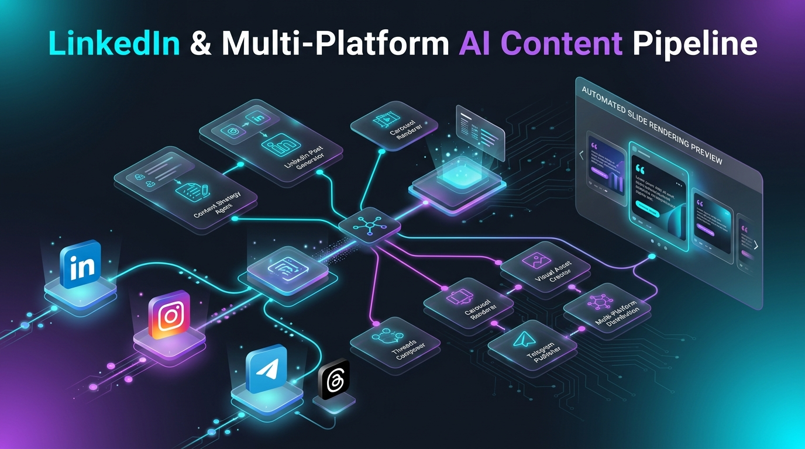
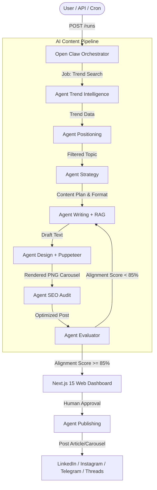

# 🤖 LinkedIn & Multi-Platform AI Content Pipeline

> **An autonomous, multi-tenant B2B content generation & publishing platform powered by microservice AI agents, RAG fact-grounding, and regulatory compliance validation.**



[](https://nodejs.org/)
[](https://www.typescriptlang.org/)
[](https://nextjs.org/)
[](https://bullmq.io/)
[](https://www.docker.com/)

---

## 📋 Table of Contents

1. [🌟 Business Value & Core Capabilities (For Clients & Stakeholders)](#-business-value--core-capabilities-for-clients--stakeholders)
   - [The Problem We Solve](#the-problem-we-solve)
   - [Key Capabilities](#key-capabilities)
   - [Niche Portal Examples (Multi-Tenancy)](#niche-portal-examples-multi-tenancy)
2. [🏗 System Architecture & Tech Stack (For Developers)](#-system-architecture--tech-stack-for-developers)
   - [Agent Interaction Flowchart](#agent-interaction-flowchart)
   - [Microservices Breakdown](#microservices-breakdown)
   - [Reliability & Brand Safety Mechanisms](#reliability--brand-safety-mechanisms)
3. [🚀 Quickstart & Setup Guide](#-quickstart--setup-guide)
   - [Prerequisites](#prerequisites)
   - [Environment Setup (.env)](#environment-setup-env)
   - [Docker Compose Deployment](#docker-compose-deployment)
   - [Database Seeding](#database-seeding)
4. [🧪 Testing & API Reference](#-testing--api-reference)
5. [🛠 Extending the Platform: Adding a New Tenant or Pillar](#-extending-the-platform-adding-a-new-tenant-or-pillar)

---

## 🌟 Business Value & Core Capabilities (For Clients & Stakeholders)

### The Problem We Solve

Creating expert B2B social media content (**LinkedIn, Instagram, Telegram, Threads**) traditionally requires a full marketing agency: *a copywriter, a domain expert (e.g., in pharmaceutical compliance or software architecture), a graphic designer, an SEO specialist, and an SMM manager*. Running such a team costs **$5,000 to $15,000+ per month**, and producing a single post takes days.

This platform completely automates the entire content engineering pipeline:
- **Reduces content marketing costs by up to 90%**.
- **Generates publish-ready posts with styled carousels in 30 seconds**.
- **Guarantees 100% Brand Safety & Regulatory Compliance** — zero numeric hallucinations, strict adherence to FDA/EMA standards (21 CFR Part 11, GxP), zero forbidden terms, and zero cross-brand hashtag leakage.

---

### Key Capabilities

- 🏢 **Multi-Tenancy Architecture:** Manage dozens of independent brands/clients on a single infrastructure with isolated style guides, color palettes, and factual knowledge bases.
- 🎯 **Automated Puppeteer Carousel Engine:** Dynamically renders high-resolution (1080x1350 PNG) branded carousels tailored to post topics without manual design tools.
- 👨‍💻 **Human-in-the-Loop Dashboard:** Feature-rich Next.js 15 Web UI for previewing, inline editing, approving, or sending runs back for auto-regeneration.
- 📚 **RAG Fact Grounding:** Automatic verification of technical specs and regulatory requirements against a database of verified facts (`fact_chunks`).
- 🤖 **Self-Correction Loop:** Evaluation agent continuously audits post quality against Golden Datasets. If an alignment score is `< 85%`, the system automatically re-generates the post before presenting it to the user.

---

### Niche Portal Examples (Multi-Tenancy)

| Portal | Target Audience | Social Platforms | Specialized Content Pillars |
| :--- | :--- | :--- | :--- |
| **Tech Portal** (`software-development-default`) | Senior Developers, Architects, CTOs | LinkedIn, Telegram, Threads | - `github-trending-repos` (Curated Repo Roundups)<br/>- `architecture-deep-dive` (System Design & Tradeoffs)<br/>- `pet-projects-showcase` (Dev Showcase) |
| **Testo Pharma Portal** (`testo`) | QA Directors, Pharma Warehouse Engineers, Logistics Managers | Instagram, Telegram, Threads | - `pharma-compliance-explained` (GxP & 21 CFR Part 11)<br/>- `pharma-cold-chain-story` (Cold Chain & GDP Logistics)<br/>- `testo-device-breakdown` (Testo B2B Equipment Breakdown) |

---

## 🏗 System Architecture & Tech Stack (For Developers)

### Agent Interaction Flowchart

The system is designed as an **asynchronous microservice graph** orchestrated by **Open Claw** via **BullMQ / Redis** job queues:



---

### Microservices Breakdown

| Microservice | Tech Stack | Responsibility |
| :--- | :--- | :--- |
| **`openclaw`** | Node.js, Express, BullMQ | Orchestrator: manages run lifecycle, state transitions, and approval APIs. |
| **`agent-trend-intelligence`** | Node.js, Jina Reader API | Scrapes trends from GitHub, Hacker News, Dev.to, and pharma portals. |
| **`agent-positioning`** | Node.js, LLM | Filters news & trends against the author's positioning matrix and company profile. |
| **`agent-content-strategy`** | Node.js, LLM | Selects content pillar, carousel/text format, and post structure. |
| **`agent-writing`** | Node.js, RAG Engine, MongoDB | Drafts post copy with prompt isolation, RAG fact verification, and hashtag sanitization. |
| **`agent-design`** | Node.js, Puppeteer Browser Pool | Generates HTML/CSS templates and renders high-resolution PNG slides. |
| **`agent-seo`** | Node.js, LLM | Audits readability, character counts, and platform-specific limits. |
| **`agent-evaluator`** | Node.js, Zod Validator | Evaluates drift against Golden Datasets, verifies disclaimers & CTAs. |
| **`agent-publishing`** | Node.js, REST APIs | Auto-publishes approved materials to social media platforms via official APIs. |
| **`web-dashboard`** | Next.js 15, React, Vanilla CSS | Full-featured frontend web dashboard for pipeline management and review. |

---

### Reliability & Brand Safety Mechanisms

1. **Strict Prompt Isolation:**
   When generating content for a specific pillar, the system prompt receives **only** the guidelines of that target pillar, preventing cross-rubric tone pollution.
2. **Bidirectional Hashtag Protection:**
   A deterministic sanitizer physically prevents tag leakage: IT tags (`#github`, `#backend`) are stripped from Testo pharma posts, and pharma tags (`#gxp`, `#pharma`) are stripped from Tech posts.
3. **Language-Aware Call-to-Actions (CTAs):**
   The pipeline detects the language of the generated text and dynamically selects matching English or Russian CTAs.
4. **Shared Puppeteer Browser Pool:**
   `getSharedBrowser()` reuses headless browser instances to prevent RAM/CPU spikes and memory leaks during image rendering.

---

## 🚀 Quickstart & Setup Guide

### Prerequisites

- **Docker** & **Docker Compose** (v2.20+)
- **Node.js** v20+ (for local development)
- **MongoDB** 6.0+ & **Redis** 7.0+ (provisioned automatically in Docker)

---

### Environment Setup (.env)

1. Clone the repository:
   ```bash
   git clone https://github.com/your-username/linkedin_ai-agent_tool.git
   cd linkedin_ai-agent_tool
   ```

2. Copy the environment configuration template:
   ```bash
   cp .env.example .env
   ```

3. Configure your API keys in `.env`:
   ```env
   NODE_ENV=development
   PORT=4000
   MONGO_URI=mongodb://mongo:27017
   MONGO_DB_NAME=linkedin_pipeline
   REDIS_HOST=redis
   REDIS_PORT=6379
   
   # AI Provider Keys
   GROQ_API_KEY=your_groq_api_key_here
   OPENROUTER_API_KEY=your_openrouter_api_key_here
   GEMINI_API_KEY=your_gemini_api_key_here
   ```

---

### Docker Compose Deployment

Spin up all 12 microservices, MongoDB, and Redis in containers:

```bash
docker compose up --build -d
```

Verify that all containers are active and healthy:
```bash
docker compose ps
```

> [!TIP]
> Web Dashboard will be available at: **[http://localhost:3000](http://localhost:3000)**  
> Open Claw Orchestrator API will be available at: **[http://localhost:4000](http://localhost:4000)**

---

### Database Seeding

Upon initial startup, seed the database with organization profiles, fact chunks, and golden datasets:

```bash
# Seed Organizations and Content Pillars
docker compose exec openclaw npx tsx services/openclaw/src/scripts/seed-organizations.ts

# Seed RAG Fact Chunks (Testo Pharma Facts)
docker compose exec openclaw npx tsx services/openclaw/src/scripts/seed-fact-chunks.ts

# Seed Golden Datasets for Quality Evaluator
docker compose exec openclaw npx tsx services/openclaw/src/scripts/seed-golden.ts
```

---

## 🧪 Testing & API Reference

You can trigger pipeline runs programmatically via `curl` or REST API tools:

### 1. Trigger Run for Tech Portal (LinkedIn / GitHub Trending):

```bash
curl -X POST http://localhost:4000/runs \
  -H "Content-Type: application/json" \
  -d '{
    "tenantId": "software-development-default",
    "targetPillarId": "github-trending-repos",
    "topic": {
      "title": "Top 5 Developer Tools 2026",
      "summary": "Best open source tools for backend engineers"
    }
  }'
```

### 2. Trigger Run for Testo Pharma (Instagram Carousel / 21 CFR Part 11):

```bash
curl -X POST http://localhost:4000/runs \
  -H "Content-Type: application/json" \
  -d '{
    "tenantId": "testo",
    "targetPillarId": "pharma-compliance-explained",
    "topic": {
      "title": "Testo Saveris Pharma System Deep Dive",
      "summary": "Automated continuous GxP temperature monitoring on pharma warehouses"
    }
  }'
```

---

## 🛠 Extending the Platform: Adding a New Tenant or Pillar

To onboard a new brand (Tenant) or introduce a new content pillar:

1. **Register the pillar in `services/openclaw/src/scripts/seed-organizations.ts`:**
   ```typescript
   contentPillars: [
     {
       id: "my-new-pillar",
       title: "My New Content Pillar",
       description: "Pillar objective and target audience guidelines",
       format: "carousel",
       weight: 0.5
     }
   ]
   ```

2. **Add copywriting rules to `services/agent-writing/src/index.ts`:**
   ```typescript
   else if (contentPillarId === "my-new-pillar") {
     rubricInstructions = `Focus on key takeaways...`;
   }
   ```

3. **Add golden dataset entries to `golden_datasets/` and run the seed script:**
   ```bash
   docker compose exec openclaw npx tsx services/openclaw/src/scripts/seed-golden.ts
   ```

---

## 📄 License & Authors

Designed & developed with modern microservice architecture and multi-tenant AI pipelines. All rights reserved.
