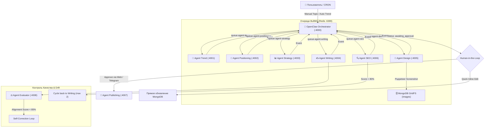

# 🏛 Архитектура Системы: LinkedIn & Multi-Platform AI Content Pipeline

> **Назначение:** Описание микросервисной мультиарендной архитектуры, очередей сообщений, работы с базами данных, политик LLM-моделей и отказоустойчивости.

---

## 1. Обзор архитектуры

Система построена на принципах **Event-Driven Microservices Architecture (EDMA)**:
* **Оркестратор (OpenClaw):** Центральный координатор потока задач. Управляет очередями BullMQ, сохраняет состояние в MongoDB и передает артефакты между стадиями.
* **Изолированные AI-агенты:** Каждый агент отвечает строго за 1 этап генерации, имеет собственную валидацию через Zod-схемы и выполняет работу через единого AI-клиента с автоматическим ретраем и экспоненциальным backoff.
* **Рендерер каруселей (`agent-design`):** Автономный микросервис на Puppeteer с пулом переиспользуемых инстансов Chromium (`getSharedBrowser()`), поддержкой кастомных тем и выгрузкой ZIP/PNG в GridFS.
* **Web Dashboard (`web-dashboard`):** Интерфейс управления на Next.js 15 (порт **3005**).
* **Telegram Bot Workflow:** Мобильный интерфейс Human-in-the-Loop для согласования и публикации через Telegram.

---

## 2. Диаграмма потока данных (Pipeline Flow)

---

## 3. Ключевые архитектурные паттерны

### 3.1. Строгая изоляция промптов (Strict Prompt Isolation)
При генерации контента для конкретной рубрики (`pillarId`) и арендатора (`tenantId`):
* В промпт попадают **ТОЛЬКО** правила и глоссарий выбранной рубрики.
* Примеры Few-Shot в `agent-writing` фильтруются строго по совпадению `{ tenantId, pillarId, platform }`.
* Никаких утечек B2B-терминов в IT-контент или IT-хэштегов в B2B-посты.

### 3.2. RAG Grounding (`FactChunkDoc`)
Для высокорегулируемых ниш (например, фармацевтика Testo) генерация опирается на предварительно сидированную базу фактов `fact_chunks`. Любые числовые значения, диапазоны и названия приборов валидируются по фактологической базе для предотвращения галлюцинаций LLM.

### 3.3. Puppeteer Browser Pool & Headless Rendering
* Микросервис `agent-design` инициализирует единый инстанс Chromium через функцию `getSharedBrowser()`, исключая накладные расходы на запуск нового процесса браузера на каждый слайд.
* Поддерживается режим **Fast Re-render / Inline Edit**: при изменении текста пользователем генерация слайдов происходит за 6-10 секунд без вызова LLM.

### 3.4. Политика LLM-моделей (Dev vs Prod)
* **PROD (`NODE_ENV === "production"`):** Используется модель **`llama-3.3-70b-versatile`** (Groq) или **`openai/gpt-oss-120b`** для обеспечения наивысшего качества копирайтинга и точной структуры.
* **DEV (`NODE_ENV !== "production"`):** Допускаются легковесные/альтернативные модели для быстрого локального тестирования и экономии квот.
* **Автоматический Retry & Backoff:** При получении `HTTP 429 (Rate Limit Exceeded)` клиент `shared-lib/src/ai/client.ts` автоматически парсит время задержки из заголовков ответа и выполняет повторный запрос с экспоненциальным backoff до 10 попыток.

---

## 4. Схема баз данных (MongoDB)

| Коллекция | Назначение |
| :--- | :--- |
| `organizations` | Мультиарендные настройки (`tenantId`, глоссарий, контентные рубрики, Tone of Voice). |
| `pipeline_runs` | Документы прогонов (метаданные, текущий статус, ошибки, alignmentScore). |
| `stage_results` | Исторические результаты каждой стадии прогона (`trend`, `positioning`, `strategy`, `writing`, `design`, `seo`). |
| `golden_datasets` | Эталонные публикации для оценки дрифта (`agent-evaluator`). |
| `fact_chunks` | База верифицированных фактов для RAG Grounding. |
| `users` | Учетные записи администраторов и создателей контента (JWT Auth). |
| `carousel_images.files / .chunks` | GridFS хранилище готовых PNG-слайдов и ZIP-архивов каруселей. |
