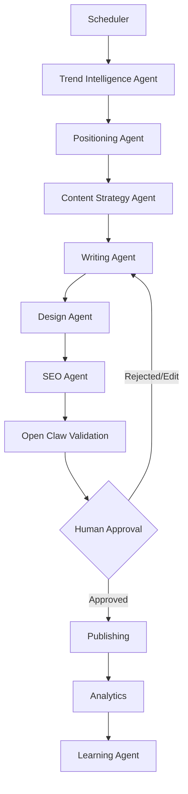

# Техническое задание: AI Content Pipeline для LinkedIn

## Описание проекта
Разработать модульную систему генерации контента для LinkedIn, основанную на специализированных AI-агентах, объединённых единым оркестратором (Open Claw).

Основная идея — отказаться от использования одного универсального AI и разделить процесс создания контента на независимые этапы, каждый из которых выполняет только одну задачу.

Open Claw выступает центральным координатором системы, отвечает за управление пайплайном, контроль качества, повторные попытки выполнения задач и итоговую валидацию результата.

---

## Цели проекта
- автоматический поиск актуальных IT-тем;
- фильтрация тем относительно позиционирования автора;
- генерация экспертного контента;
- сохранение авторского стиля;
- генерация единообразного дизайна;
- автоматическая проверка качества;
- возможность ручного подтверждения перед публикацией;
- последующее обучение системы на основе аналитики.

---

## Общая архитектура

---

## Основные компоненты

### 1. Trend Intelligence Agent
Сбор актуальных тем из различных источников (Hacker News, GitHub Trending, Dev.to, Reddit и др.), их ранжирование и группировка.

### 2. Positioning Agent
Сравнение найденных тем с профилем автора (Node.js, Next.js, AI, SaaS и т.д.) и оценка релевантности.

### 3. Content Strategy Agent
Выбор формата публикации (Story, Tutorial, opinion, case study и др.) и определение ключевой идеи.

### 4. Writing Agent
Генерация текста публикации на основе стиля автора, его настроек (длина предложений, использование эмодзи) и базы знаний.

### 5. Design Agent
Создание визуального оформления (шаблоны SVG / HTML / Figma JSON) — генерация картинок нейросетями не используется.

### 6. SEO Agent
Проверка качества публикации (hook, читаемость, CTA, теги) и выдача рекомендаций по улучшению.

---

## Роль Open Claw
Open Claw является оркестратором и валидатором (Workflow Engine):
- Запускает агентов последовательно через очереди BullMQ.
- Обрабатывает ошибки и делает повторные попытки (retries).
- Проводит сквозной контроль качества и координирует итерации доработки.
- Предоставляет API для Human Approval (подтверждения пользователем).
