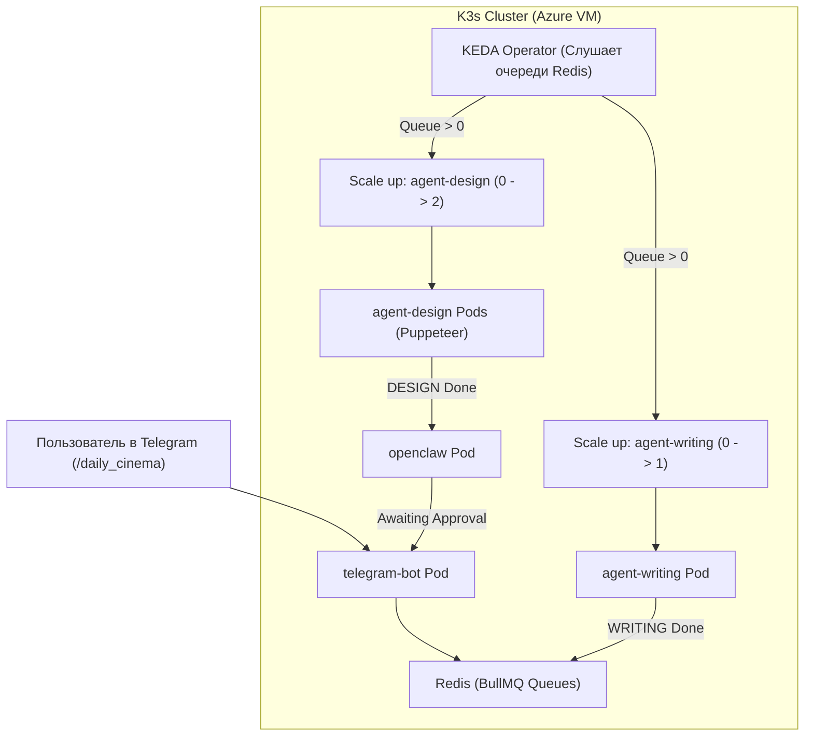

# ☸️ Архитектурная концепция: Деплой AI Pipeline на Azure (Student Tier) + K3s / Kubernetes

> **Статус:** Концепция / Идея для продакшн-деплоя  
> **Целевая среда:** Microsoft Azure for Students ($100 Free Credit)  
> **Оркестрация:** K3s (Lightweight Kubernetes) + KEDA (Event-Driven Autoscaling)  
> **Мультиарендность:** 3 портала (`software-development-default`, `testo`, `cinema-media`)  

---

## 🎯 1. Цели и преимущества

1. **Минимальная себестоимость ($0 реальных затрат):**
   * Использование студенческого гранта Azure ($100 на 12 месяцев).
   * Использование бесплатного пула инференса **Groq LPU Cloud** (`openai/gpt-oss-120b`, `qwen`) и **Google Gemini** (`gemini-2.0-flash`).
2. **Максимальная экономия ресурсов (Scale-to-Zero через KEDA):**
   * Неактивные агенты (Strategy, Positioning, Evaluator, SEO) находятся в спящем режиме (`replicas: 0`) и не потребляют RAM.
   * Дизайнеры (`agent-design`) и копирайтеры (`agent-writing`) автоматически масштабируются при появлении задач в очередях Redis (BullMQ).
3. **Self-Healing (Отказоустойчивость):**
   * Автоматический перезапуск упавших инстансов Chromium (Puppeteer) по Liveness/Readiness Probes.
4. **Портфолио-ценность:**
   * Промышленный стек: Multi-Agent AI + BullMQ + Kubernetes Event-Driven Autoscaling (KEDA) на облачной инфраструктуре.

---

## 💰 2. Экономический расчёт инфраструктуры

| Компонент | Конфигурация | Стоимость в месяц | Покрытие грантом |
| :--- | :--- | :--- | :--- |
| **Azure VM** | `Standard_B1ms` (1 vCPU, 2 GB RAM, 64 GB SSD) | $\approx$ **$12 – $14 / мес** | $100 покрывают **7–8 месяцев** работы |
| **Альтернатива VM** | `Standard_B2s` (2 vCPU, 4 GB RAM, 64 GB SSD) | $\approx$ **$25 – $28 / мес** | $100 покрывают **3.5–4 месяца** работы |
| **Groq API** | Free Tier (30 req/min, 200k tokens/day) | **$0.00** | 100% бесплатно |
| **Gemini API** | Free Tier (15 RPM, 1500 RPD) | **$0.00** | 100% бесплатно |
| **Telegram Bot API** | Polling / Webhook | **$0.00** | 100% бесплатно |

> [!TIP]
> **Лайфхак экономии кредитов:** Настроив автоматическое отключение VM на ночные часы (например, с 02:00 до 08:00 через Azure Portal Auto-Shutdown), $100 гранта хватит практически на **весь учебный год**!

---

## 🏗️ 3. Архитектура: Почему K3s, а не стандартный K8s

* **Стандартный Kubernetes (AKS / kubeadm):** Управляющий слой (Control Plane, etcd, CoreDNS) требует 1.5–2.5 GB RAM только для самого K8s.
* **K3s (от Rancher):**
  * Потребляет всего **~400–500 МБ RAM**.
  * 100% совместим с Kubernetes API, `kubectl`, Helm и манифестами.
  * Устанавливается одной командой: `curl -sfL https://get.k3s.io | sh -`.

---

## ⚡ 4. Схема работы KEDA Autoscaler с BullMQ



---

## 📋 5. Пошаговый план развёртывания

### Шаг 1: Создание Virtual Machine в Azure
1. Создать VM: `Ubuntu 24.04 LTS`, размер `Standard_B1ms` или `Standard_B2s`.
2. Открыть в NSG входящие порты:
   * `22` — SSH
   * `80`, `443` — HTTP/HTTPS (Ingress Traefik)
   * `3000` — Web Dashboard

### Шаг 2: Установка K3s на VM
```bash
# Подключение по SSH
ssh azureuser@<VM_PUBLIC_IP>

# Установка K3s
curl -sfL https://get.k3s.io | sh -
sudo chmod 644 /etc/rancher/k3s/k3s.yaml
export KUBECONFIG=/etc/rancher/k3s/k3s.yaml
```

### Шаг 3: Установка Helm и KEDA
```bash
# Установка Helm
curl https://raw.githubusercontent.com/helm/helm/main/scripts/get-helm-3 | bash

# Установка KEDA для очередей Redis
helm repo add kedacore https://kedacore.github.io/charts
helm repo update
helm install keda kedacore/keda --namespace keda --create-namespace
```

### Шаг 4: Структура манифестов в репозитории
```
k8s/
├── namespace.yaml
├── configmap-env.yaml
├── secret-api-keys.yaml
├── storage/
│   ├── mongo-pvc.yaml
│   └── redis-pvc.yaml
├── core/
│   ├── mongo-deployment.yaml
│   ├── redis-deployment.yaml
│   ├── openclaw-deployment.yaml
│   └── telegram-bot-deployment.yaml
├── workers/
│   ├── agent-writing-deployment.yaml
│   └── agent-design-deployment.yaml
├── autoscaling/
│   ├── keda-writing-scaler.yaml
│   └── keda-design-scaler.yaml
└── ingress/
    └── traefik-ingress.yaml
```

---

## 📌 6. Статус и следующие шаги
- [x] Архитектурная концепция зафиксирована.
- [ ] Подготовка базовых манифестов `k8s/*.yaml` в отдельной ветке.
- [ ] Тестирование локально в Minikube / K3d.
- [ ] Деплой на Azure VM при необходимости перехода на облачный хостинг.
