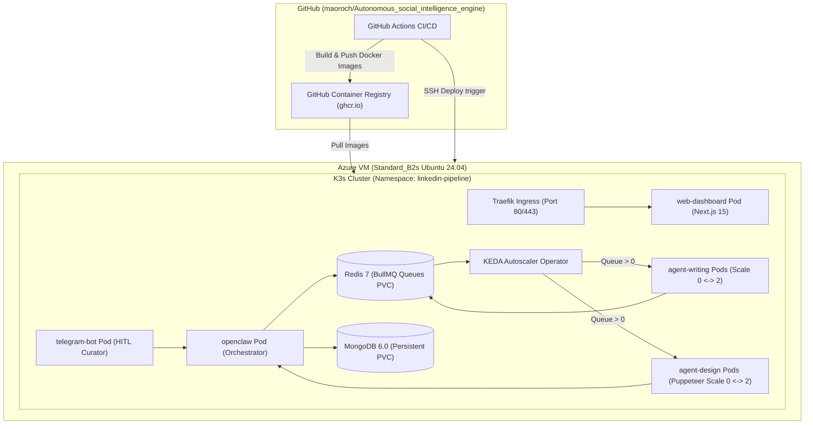

# ☸️ Полное руководство по деплою: Microsoft Azure (Student Tier) + K3s + KEDA + CI/CD

> **Цель:** Развернуть **LinkedIn & Multi-Platform AI Content Pipeline** на облачной инфраструктуре **Microsoft Azure for Students ($100 Free Credit)** с автоматическим CI/CD пайплайном в **GitHub Actions** и масштабированием рабочих воркеров от 0 до N через **KEDA (Event-Driven Autoscaler)**.

---

## 📑 Содержание

1. [Архитектура решения](#1-архитектура-решения)
2. [Предварительные требования](#2-предварительные-требования)
3. [Шаг 1: Создание Virtual Machine в Azure](#шаг-1-создание-virtual-machine-в-azure)
4. [Шаг 2: Установка K3s, Helm и KEDA](#шаг-2-установка-k3s-helm-и-keda)
5. [Шаг 3: Настройка GitHub Actions CI/CD](#шаг-3-настройка-github-actions-cicd)
6. [Шаг 4: Развёртывание манифестов в кластере](#шаг-4-развёртывание-манифестов-в-кластере)
7. [Шаг 5: Бесплатный SSL (HTTPS) и домен](#шаг-5-бесплатный-ssl-https-и-домен)
8. [Диагностика, логи и масштабирование KEDA](#диагностика-логи-и-масштабирование-keda)

---

## 🏗️ 1. Архитектура решения



---

## 🔑 2. Предварительные требования

1. **Azure for Students Аккаунт:**
   - Активирован студенческий грант **$100 на 12 месяцев** на [portal.azure.com](https://portal.azure.com).
2. **Установленные локальные утилиты:**
   - `git`
   - `az` (Azure CLI): `brew install azure-cli` (macOS) или `winget install Microsoft.AzureCLI` (Windows).
   - `ssh-keygen` (публичный ключ `~/.ssh/id_rsa.pub`).
3. **API Ключи (Бесплатные):**
   - **Groq API Key:** [console.groq.com](https://console.groq.com) (`llama-3.3-70b-versatile` / `openai/gpt-oss-120b`).
   - **Google Gemini API Key:** [aistudio.google.com](https://aistudio.google.com) (`gemini-2.0-flash`).
   - **Telegram Bot Token:** `@BotFather` в Telegram.

---

## 💻 Шаг 1: Создание Virtual Machine в Azure

Запустите готовый скрипт автоматического создания ресурсов:

```bash
# Клонируем репозиторий локально
git clone https://github.com/maoroch/Autonomous_social_intelligence_engine.git
cd Autonomous_social_intelligence_engine

# Запуск создания ресурсов в Azure
bash scripts/azure/provision-vm.sh
```

### Что делает скрипт:
1. Создает Resource Group: `rg-linkedin-pipeline` в регионе `eastus`.
2. Создает VM размера **`Standard_B2s`** (2 vCPU, 4 GB RAM, 64 GB SSD) на базе **Ubuntu 24.04 LTS**.
3. Настраивает правила файрвола (NSG) для портов:
   - `22` (SSH)
   - `80` (HTTP Ingress)
   - `443` (HTTPS Ingress)
   - `3000` (Direct Web Dashboard)
4. Выводит публичный IP-адрес вашей VM.

> [!TIP]
> **Автоотключение для экономии кредитов:** В Azure Portal перейдите в созданную VM $\rightarrow$ **Operations** $\rightarrow$ **Auto-shutdown** $\rightarrow$ установите отключение в 02:00 ночи. Это позволит растянуть $100 гранта на 9–10 месяцев!

---

## ⚙️ Шаг 2: Установка K3s, Helm и KEDA

Подключитесь к вашей виртуальной машине по SSH:

```bash
ssh azureuser@<YOUR_VM_PUBLIC_IP>
```

Запустите скрипт автоматической установки кластера:

```bash
curl -sSL https://raw.githubusercontent.com/maoroch/Autonomous_social_intelligence_engine/main/scripts/azure/setup-k3s.sh | bash
```

### Что устанавливается:
- **K3s:** Легковесный Kubernetes (потребляет всего ~400 МБ RAM).
- **Helm 3:** Пакетный менеджер Kubernetes.
- **KEDA (v2.14+):** Оператор автомасштабирования по очередям Redis BullMQ.
- Клонируется свежая ветка `main` в директорию `~/linkedin_ai-agent_tool`.

---

## 🚀 Шаг 3: Настройка GitHub Actions CI/CD

Для того чтобы при каждом `git push origin main` происходил автоматический билд в GHCR и деплой на виртуальную машину, настройте GitHub Secrets:

1. Перейдите в ваш GitHub репозиторий $\rightarrow$ **Settings** $\rightarrow$ **Secrets and variables** $\rightarrow$ **Actions**.
2. Добавьте **Variables (Repository Variables)**:
   - `AZURE_VM_HOST`: Публичный IP-адрес вашей VM (например, `20.120.45.67`).
   - `AZURE_VM_USER`: `azureuser` (или ваш логин).
3. Добавьте **Secrets (Repository Secrets)**:
   - `AZURE_VM_SSH_KEY`: Приватный SSH-ключ (`cat ~/.ssh/id_rsa`).

Теперь при каждом пуше в `main` GitHub Actions:
- Прогонит тайпчек и unit-тесты (`ci.yml`).
- Соберёт все 8 Docker-образов и опубликует их в `ghcr.io/maoroch/linkedin-ai-...` (`cd-deploy.yml`).
- По SSH подключится к Azure VM и перезапустит деплойменты через `kubectl apply -k k8s/`.

---

## 📦 Шаг 4: Развёртывание манифестов в кластере

Находясь на Azure VM в папке `~/linkedin_ai-agent_tool`:

1. **Заполните боевые API ключи в секретах:**
   ```bash
   nano k8s/secret-template.yaml
   ```
   Вставьте ваши реальные `GROQ_API_KEY`, `TELEGRAM_BOT_TOKEN`, `TELEGRAM_ADMIN_CHAT_ID`, `AUTH_SECRET`.

2. **Запустите деплой одной командой:**
   ```bash
   bash scripts/azure/deploy-k8s.sh
   ```

3. **Проверьте статус подов:**
   ```bash
   kubectl get pods -n linkedin-pipeline
   ```

Пример вывода:
```
NAME                                READY   STATUS    RESTARTS   AGE
mongo-79f8b48858-x9p2q              1/1     Running   0          2m
redis-54cf68b757-q92k8              1/1     Running   0          2m
openclaw-55866dc649-7mkl8           1/1     Running   0          2m
telegram-bot-65bc8885c5-w82jx       1/1     Running   0          2m
agent-trend-847f9c8959-l9p21        1/1     Running   0          2m
agent-writing-7d767597bc-0          1/1     Running   0          2m
agent-design-5dfcb659c8-0           1/1     Running   0          2m
agent-evaluator-59bf896944-x821q    1/1     Running   0          2m
agent-publishing-5ccb4f595f-9k2px   1/1     Running   0          2m
web-dashboard-769cb68d99-528kl      1/1     Running   0          2m
```

---

## 🔒 Шаг 5: Бесплатный SSL (HTTPS) и домен

В K3s встроен Traefik Ingress. Для привязки бесплатного домена и SSL:

1. **Вариант А (Бесплатный Cloudflare DNS + Proxy):**
   - Направьте ваш домен (например, `ai-content.yourdomain.com`) записью `A` на публичный IP вашей VM в Cloudflare.
   - Включите оранжевый значок Cloudflare Proxy (SSL Full) $\rightarrow$ HTTPS заработает мгновенно без настройки сертификатов на сервере!

2. **Вариант Б (Cert-Manager + Let's Encrypt в K8s):**
   ```bash
   # Установка cert-manager
   kubectl apply -f https://github.com/cert-manager/cert-manager/releases/download/v1.14.4/cert-manager.yaml
   ```

---

## 📊 Диагностика, логи и масштабирование KEDA

### 1. Проверка работы KEDA Autoscaler (Scale-to-Zero):
```bash
kubectl get scaledobjects -n linkedin-pipeline
```
В состоянии покоя `agent-writing` и `agent-design` имеют `0` реплик. Как только в Telegram-боте нажимается кнопка генерации, BullMQ ставит задачу в очередь Redis, и KEDA автоматически поднимает поды за 2–3 секунды!

### 2. Просмотр логов любого микросервиса:
```bash
# Логи OpenClaw оркестратора
kubectl logs -f -n linkedin-pipeline -l app=openclaw

# Логи Telegram Бота
kubectl logs -f -n linkedin-pipeline -l app=telegram-bot

# Логи Puppeteer рендерера
kubectl logs -f -n linkedin-pipeline -l app=agent-design
```

### 3. Перезапуск сервисов после обновления:
```bash
kubectl rollout restart deployment -n linkedin-pipeline
```

---

## 🎯 Итог

Вы получили готовую к промышленной эксплуатации, отказоустойчивую мультиарендную систему генерации контента, которая:
- Работает в облаке **Microsoft Azure за $0 реальных затрат**.
- Автоматически обновляется через **GitHub Actions CI/CD**.
- Экономит память с помощью **KEDA Scale-to-Zero**.
- Управляется через **Telegram Bot** и визуальный **Next.js Dashboard**.
