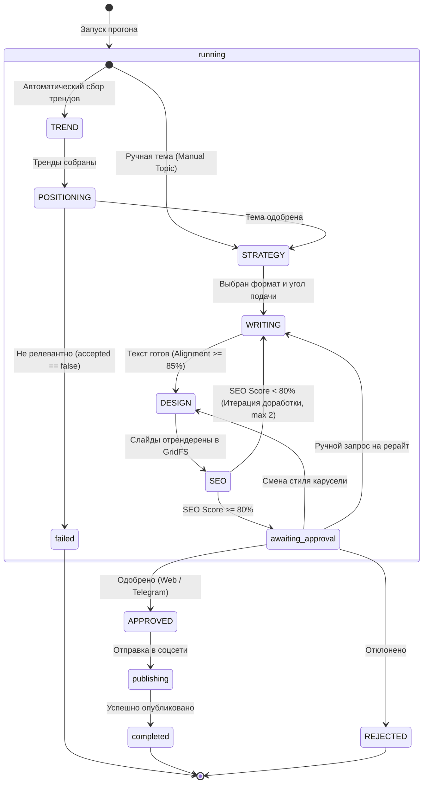

# 🎯 Оркестратор OpenClaw: Спецификация и Жизненный Цикл

> **Назначение:** Полное техническое описание центрального ядра системы (Workflow Engine) OpenClaw: управление стадиями, обработка событий, контроль качества и очереди.

---

## 1. Роль и задачи OpenClaw

OpenClaw (`services/openclaw`) — это координатор всего процесса генерации контента:
1. **Создание и валидация прогонов (`runs`):** Прием запросов через REST API (`POST /runs`, `GET /runs/:runId`, `POST /runs/:runId/approve`).
2. **Маршрутизация очередей BullMQ:** Формирование `AgentJob` для каждого агента с проверкой Zod-контрактов.
3. **Обработка событий (`queue-pipeline-events`):** Получение результатов от агентов, сохранение в `stage_results` и перевод на следующий этап.
4. **Контроль качества (Quality Loop):** Анализ SEO Score и Alignment Score с возвратом на доработку при необходимости.
5. **Manual Topic Override:** Пропуск этапа поиска трендов, если тема задана пользователем вручную.

---

## 2. Машина состояний (Pipeline State Machine)

---

## 3. Схема очередей BullMQ

| Очередь (Queue Name) | Источник | Обработчик | Payload |
| :--- | :--- | :--- | :--- |
| `queue-agent-trend` | OpenClaw | `agent-trend-intelligence` | `{ tenantId, pillarId }` |
| `queue-agent-positioning` | OpenClaw | `agent-positioning` | `{ tenantId, trends }` |
| `queue-agent-strategy` | OpenClaw | `agent-content-strategy` | `{ tenantId, topic, targetPillarId }` |
| `queue-agent-writing` | OpenClaw | `agent-writing` | `{ tenantId, strategy, topic, extraInstructions }` |
| `queue-agent-design` | OpenClaw | `agent-design` | `{ tenantId, writingResult, template_name, isInlineEdit }` |
| `queue-agent-seo` | OpenClaw | `agent-seo` | `{ tenantId, postText, hook, cta }` |
| `queue-agent-publishing` | OpenClaw | `agent-publishing` | `{ tenantId, postData, platforms }` |
| `queue-pipeline-events` | Все агенты | OpenClaw | `{ runId, stage, status, result, error }` |

---

## 4. Алгоритмы и логика оркестрации

### 4.1. Обработка ручных тем (Manual Topic Override)
Если при создании прогона в `POST /runs` передан объект `topic` (`topic.title` и `topic.summary`):
1. OpenClaw автоматически фиксирует искусственные результаты стадий `trend` и `positioning` в `stage_results`.
2. Стадия `trend` помечается как выполненная.
3. Первая задача в очереди ставится сразу для `agent-content-strategy`.
4. Это исключает перезапись ручной темы рандомными трендами из интернета.

### 4.2. Контроль качества (Quality Loop)
* После завершения стадии `SEO` OpenClaw анализирует `score` (0–100).
* Если `score < 80` и количество попыток `< 2`, оркестратор возвращает пайплайн на стадию `WRITING`, добавляя список рекомендаций аудитора в поле `extraInstructions`.

### 4.3. Быстрый перезапуск рендеринга (Fast Re-render)
* При получении события смены стиля или редактирования текста в MongoDB, OpenClaw отправляет задачу в `queue-agent-design` с флагом `isInlineEdit: true`.
* `agent-design` пропускает вызовы LLM и моментально перерендеривает PNG-карточки через Puppeteer.
