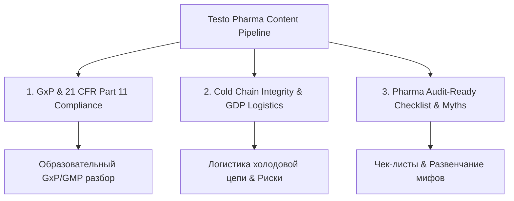

# Стратегия и Контекст: Testo SE & Co. KGaA (Фармацевтическое Направление)

Данный документ содержит исчерпывающую информацию о немецкой компании **Testo SE & Co. KGaA**, ее решениях для фармацевтической отрасли и спецификацию **3-х ключевых фармацевтических рубрик** для генерации контента.

---

## 1. О компании Testo SE & Co. KGaA

* **Год основания и штаб-квартира:** Основана в 1957 году, штаб-квартира в городе Титизе-Нойштадт (Шварцвальд, Германия).
* **Специфика:** Мировой лидер в производстве портативной и стационарной измерительной техники высокого класса точности.
* **Слоган бренда:** *«Testo. Be Sure.»* (Гарантия точности, надежности и немецкого качества).
* **Ключевые продуктовые экосистемы:**
  1. **Testo Saveris Pharma:** Автоматизированная система мониторинга микроклимата для фармацевтической промышленности и медицины.
  2. **HVAC/R & Энергоаудит:** Цифровые манометрические коллекторы, газоанализаторы и тепловизоры (testo 883).
  3. **Food Safety (HACCP):** Системы контроля качества фритюрного масла (testo 270) и температуры пищевых продуктов.
  4. **Testo Industrial Services GmbH:** Отдельное подразделение по услугам калибровки, квалификации чистых помещений и GxP-валидации.

---

## 2. Фармацевтическая экосистема: Testo Saveris Pharma

Фармацевтическая отрасль требует непрерывного контроля температуры, влажности, перепада давления и уровня CO2 на всех этапах производства и логистики.

### Ключевые технологические преимущества Testo Saveris Pharma:
* **Соответствие 21 CFR Part 11 (FDA) & Annex 11 (EMA):** Полная защита электронных записей, встроенная электронная подпись пользователя и неизменяемый журнал аудита (**Audit Trail**).
* **Трёхуровневая избыточность данных (3-tier Data Redundancy):** Данные одновременно сохраняются:
  1. На независимой памяти каждого автономного логгера;
  2. На базовой станции;
  3. В центральном сервере/облачной системе.
  * *Результат:* Никакие данные не теряются даже при полном отключении локальной сети или электропитания.
* **Готовность к инспекциям (Audit-Ready Status):** Автоматическая генерация отчетов без человеческого фактора и бумажной рутины.

---

## 3. Спецификация 3-х Фармацевтических Контентных Рубрик (Pharma Pillars)

Для фокусного генерации экспертного контента в Instagram/LinkedIn зафиксированы **3 основные контентные рубрики**:

---

### 📌 Рубрика 1: `pharma-compliance-explained`
**Название:** GxP & 21 CFR Part 11 Compliance (Стандарты регуляторов)
* **Суть:** Образовательный экспертный контент простым языком о требованиях FDA, EMA, GMP и GDP. Объяснение терминов Audit Trail, Data Integrity, ERES (Electronic Records & Signatures).
* **Формат:** Экспертная Карусель (5–7 слайдов).
* **Целевая аудитория:** QA-менеджеры фарм-производств, специалисты по квалификации и валидации.
* **Главная цель:** Продемонстрировать экспертность и показать, как Testo Saveris закрывает нормативные требования без риска штрафов.
* **Пример Hook (Обложки):**
  > *«Одно отклонение на 2°C — и вся партия лекарства идет под списание. Что именно проверяет аудитор FDA по 21 CFR Part 11?»*

---

### 📌 Рубрика 2: `pharma-cold-chain-story`
**Название:** Cold Chain Integrity & GDP Logistics (Холодовая цепь без слепых зон)
* **Суть:** Проблемный контент о логистике и хранении термолабильных препаратов. Анализ "слепых зон" при транспортировке (простои на таможне, разгрузка в жару, человеческий фактор).
* **Формат:** Схематичная Карусель / Скрипт для Reels (цепочка движения партии от завода до аптеки).
* **Целевая аудитория:** Логисты холодовой цепи (GDP), руководители фарм-складов, дистрибьюторы.
* **Главная цель:** Вызвать осознание риска потери партии и показать роль непрерывного трёхуровневого мониторинга.
* **Пример Hook (Обложки):**
  > *«Где рвётся холодовая цепь? 40 минут простоя в жару, о которых никто не доложил.»*

---

### 📌 Рубрика 3: `pharma-audit-ready`
**Название:** Pharma Audit-Ready Checklist & Myths (Подготовка к инспекциям)
* **Суть:** Практический контент для подготовки к аудитам FDA / EMA / Минпромторга. Разбор ошибок при ведении журналов, разница между "просто логированием" и "настоящим GxP-мониторингом".
* **Формат:** Чек-лист Карусель (4–5 слайдов) с блоками "Миф ❌ vs Реальность ✅".
* **Целевая аудитория:** Директора по качеству, главные инженеры фармзаводов, аудиторы.
* **Главная цель:** Высокая сохраняемость в закладки (Save Rate) и вовлечение аудитории.
* **Пример Hook (Обложки):**
  > *«Миф: "Если данные о температуре записываются — этого достаточно для прохождения аудита".»*

---

## 4. Портреты Аудитории (Personas) и Имена Терминов

| ID Персоны | Должность / Роль | Главные Болевые Точки |
|:---|:---|:---|
| `qa-pharma-manager` | QA-менеджер фарм-производства | Риск браковки партии из-за температуры; сбои перед аудитом FDA/EMA; ручной сбор бумаг |
| `validation-specialist` | Специалист по валидации/квалификации | Сложность документирования ERES; сжатые сроки; человеческий фактор при записи |
| `cold-chain-logistics` | Логист холодовой цепи (GDP) | Отсутствие контроля температуры в пути; штрафы за нарушение GDP; претензии от клиентов |

### Отраслевой Глоссарий (Glossary):
* **21 CFR Part 11** — Регламент FDA (США) к электронным записям и подписям.
* **GxP / GMP / GDP** — Наборы правил (Good Practice / Manufacturing / Distribution).
* **Audit Trail** — Неизменяемый системный журнал регистраций всех действий пользователей.
* **Холодовая цепь (Cold Chain)** — Непрерывный температурный режим от производства до пациента.
* **Лиофилизация (Freeze-drying)** — Сушка-заморозка медикаментов, требующая точного профиля температуры.

---

## 5. Техническая адаптация в коде пайплайна

1. **Мультиарендность:** Использование `tenantId: "testo"`.
2. **Палитра брендинга (Testo Brand Palette):** `["#EE8432", "#14171A", "#FAF9F6"]` (Оранжевый акцент Testo, тёмно-серые чернила, светлый бумажный фон).
3. **Ограничения Instagram:**
   * Длина подписи (Caption) $\le 400$ символов.
   * `maxEmojis: 0` в основном теле текста (строгий инженерный тон).
   * Обязательный дисклеймер: *"Технические характеристики уточняйте в актуальной документации производителя."*
   * Мягкий призыв к действию (Soft CTA): *"Сохраните пост перед следующим аудитом."*
4. **RAG Grounding:** Использование базы `PHARMA_FACT_CHUNKS` для верификации любых числовых характеристик перед генерацией текста.
